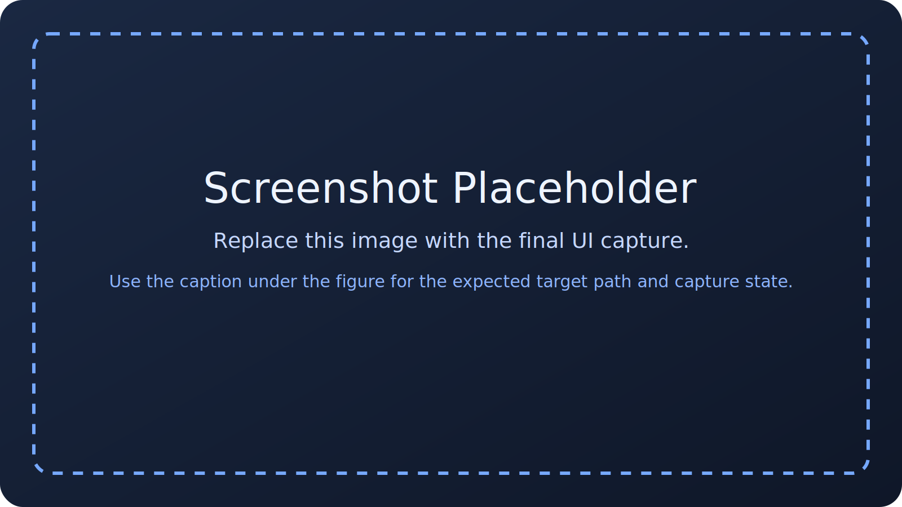

# eBUS Config Tools

Use **eBUS Config Tools** when an acquisition carries a readable eBUS Player `.pvcfg` snapshot and you need to inspect the raw snapshot, compare sources, or decide whether an app-side canonical override is justified.

This plugin does **not** replace the datacard wizard. It complements it.

The current plugin provides three workflows:

- inspect one standalone `.pvcfg` file
- compare multiple sources in **raw** or **effective** mode
- open the datacard wizard when that plugin is enabled

*Placeholder — Add screenshot: eBUS Config Tools actions in the Plugins menu and the compare dialog open with several loaded sources. Target: `docs/assets/images/user-guide/data/ebus-tools-menu-and-compare.png`. Theme: dark. Type: screenshot. State: compare dialog visible with a multi-source list and changed rows in the table.*

## Mental model

The current app uses this model:

- the raw `.pvcfg` file is an immutable baseline snapshot
- the app never edits that XML file
- app-side interpretation differences live outside the snapshot, primarily through canonical metadata and optional eBUS overrides in the datacard
- manual acquisition metadata authoring still belongs in the datacard wizard

Operationally, this means:

- use the raw snapshot when you want to know what eBUS actually saved
- use effective compare when you want to know how the app will interpret one acquisition after approved app-side override layers are applied
- use the datacard wizard when the scientific record must preserve canonical acquisition metadata, not just raw eBUS state

## Inspect one raw `.pvcfg`

Use **Inspect eBUS Config File...** when you need a read-only view of a saved eBUS snapshot.

The inspect dialog shows:

- grouped sections such as `device`, `device.communication`, `stream`, and `context`
- raw values as saved in the file
- normalized values used for compare logic when possible
- catalog relevance classification
- whether a parameter is app-overridable
- any canonical mapping derived from the acquisition field mapping

Use this dialog to verify what the camera or eBUS software actually recorded before deciding whether an app-side canonical override is justified.

## Compare dialog overview

Use **Compare eBUS Configs...** when you need to compare several sources.

The compare dialog maintains a transient source list for the current session.

### Ways to add sources

- **Add File...** adds one standalone `.pvcfg` file
- **Add Folder...** recursively finds `.pvcfg` files under one folder and adds each discovered file as its own standalone source
- opening the compare dialog from the main window may automatically preload the **currently selected dataset folder** as an acquisition source when that folder has one readable root-level `.pvcfg`

Important distinction:

- standalone `.pvcfg` files contribute raw snapshots only
- acquisition-root sources can also contribute app-side eBUS overrides stored in the datacard

That distinction matters only in **effective** compare mode.

## Raw compare versus effective compare

### Raw eBUS Compare

Raw compare answers:

- what did eBUS actually save in each file?
- which device, stream, or context parameters differ between snapshots?

Use raw compare for forensic or reproducibility checks tied to the original saved snapshots.

### Effective Acquisition Compare

Effective compare answers:

- what settings should this source be interpreted as in the app after the app-side eBUS override layer is considered?
- which differences remain meaningful once canonical eBUS-managed values are resolved through the app's acquisition model?

Effective compare overlays:

- the raw snapshot baseline
- plus any `external_sources.ebus.overrides` present for acquisition-root sources

For standalone `.pvcfg` files, effective compare usually collapses to the raw snapshot because those sources do not carry acquisition-side override context.

*Placeholder — Add screenshot: Compare dialog showing at least three loaded sources in raw mode and effective mode, with one difference only visible in effective mode. Target: `docs/assets/images/user-guide/data/ebus-raw-vs-effective-compare.png`. Theme: dark. Type: screenshot. State: changed-only filter enabled with a transient multi-source list visible.*

## Compare filters and controls

The compare dialog supports:

- **Changed only** — hide rows that are identical across loaded sources
- **Mapped fields only** — restrict the table to parameters that map back to canonical app metadata fields
- **Relevance** — filter by catalog relevance such as scientific, operational, or UI-noise classifications
- **Mode** — switch between raw and effective comparison

Use these controls to move between broad forensic inspection and narrow engineering comparison.

## Interaction with the Datacard Wizard

When an acquisition has a readable root-level eBUS snapshot, some canonical datacard fields can become **eBUS-managed**.

Current behavior:

- those fields remain visible in the wizard
- non-overridable fields become read-only
- fields flagged `overridable` in the eBUS catalog stay editable in the wizard Defaults tab
- the wizard indicates whether the shown value comes from the raw snapshot baseline or from an app-side override over that baseline
- those fields are excluded from frame-targeted override generation in the wizard

This keeps the eBUS plugin standalone for inspect and compare while leaving canonical acquisition authoring in one place: the datacard wizard.

## When to leave the eBUS plugin and use the wizard

Leave the eBUS plugin and move into the datacard wizard when:

- the raw eBUS value is not the acquisition truth you need to preserve
- the scientific record must capture a canonical app-side value that eBUS did not represent well
- the acquisition metadata needs authored defaults or frame-targeted mapping, not only raw snapshot inspection
- the field you care about is one of the catalog-approved acquisition-wide eBUS overrides

## Common interpretation mistakes

### Raw and effective compare show the same result

This does not necessarily mean the feature is broken. It may simply mean:

- no app-side eBUS overrides exist for the loaded acquisition source
- only standalone `.pvcfg` files were added
- the differing keys are not catalog-overridable

### Adding a folder did not compare acquisition overrides

`Add Folder...` discovers `.pvcfg` files, not acquisition roots. Those sources are treated as standalone snapshots.

If you need effective compare with acquisition-side overrides, start from the actual dataset folder in the main window so the current acquisition can be preloaded as an acquisition source.

## Recommended next pages

- [Data Workflow](../data-workflow.md)
- [Datacard Wizard](datacard-wizard.md)
- [Reference: eBUS Parameter Catalog](../../reference/ebus-parameter-catalog.md)
